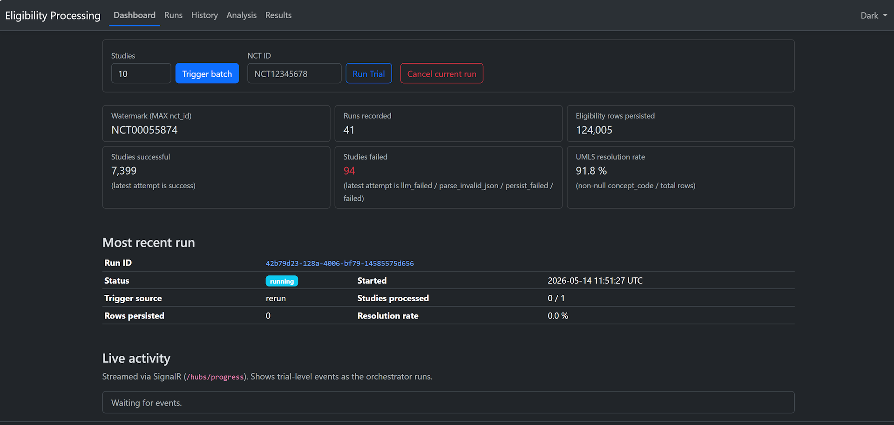

# ClinicalEligibility

Pipeline that converts raw clinical-trial eligibility criteria into structured,
UMLS-coded records - turning prose like

> *Inclusion: Adults 18-75 with histologically confirmed Type 2 Diabetes Mellitus*

into normalised rows in Postgres, each tagged with a UMLS Concept Unique
Identifier, semantic type, source vocabulary, and a confidence score.

Built on .NET 8, as a re-implementation of a production n8n workflow (reference
run: 50 studies -> 374 rows -> ~88% UMLS resolution in ~11 minutes). See
[`docs/specs/`](docs/specs/) for the canonical specification and the .NET
architecture mapping, and [`Installation.md`](Installation.md) for a
from-scratch setup runbook.

The whole web app is behind **authentication and role-based authorization**
(user-ID/password or Google sign-in with account linking; Owner / Administrator
/ Author / Viewer roles), with **per-record attribution** on authored content
and an append-only **audit log** of every manual create/update/delete and login.



## What it does

For each invocation, the pipeline:

1. Reads the **already-attempted set** - the distinct `NCT_ID`s with a row in
   `public.eligibility_study` (the per-trial audit table). This is what the
   re-implementation uses in place of the original `MAX(nct_id)` watermark.
2. Selects the next *N* untouched trials from
   [AACT](https://aact.ctti-clinicaltrials.org/) (`ctgov.eligibilities`),
   anti-joining out the already-attempted set, in Forward (earliest first) or
   Recent (most-recent first) order.
3. Sends each trial's free-text criteria to an **OpenAI-compatible LLM**
   (production reference: Gemma served via llama.cpp behind nginx) with a strict
   JSON-array system prompt.
4. Parses the response defensively - strips fences, discards preamble, runs a
   comprehensive set of repair passes against malformed JSON (20+ patterns) into
   per-criterion records.
5. Resolves each `Concept` against the **UMLS UTS REST API** (or a local Postgres
   Metathesaurus) using a composite scorer (Levenshtein similarity, Jaccard token
   containment, acronym bonus; max wins, threshold 0.45).
6. Fetches semantic types for resolved CUIs.
7. **Merges duplicate concepts** within a trial - records sharing
   `(ConceptCode, SemanticType, Criterion)` collapse into a single row whose
   `OriginalText` is the space-joined source snippets.
8. Persists each trial in **one transaction** (`DELETE WHERE nct_id = X; INSERT ...`
   - trial-idempotent, crash-resumable).
9. Emits batch metrics + completion / error notifications.

## Architecture

Two hosts share one composition root and pipeline: a **CLI** (`migrate` / `run` /
maintenance commands) and a **Web host** (dashboard + `POST /trigger`). The Web
host runs the orchestrator in-process so a SignalR hub can broadcast live
trial-by-trial progress to dashboard clients.

| Project | Role |
| :--- | :--- |
| [`EligibilityProcessing.Core`](contexts/eligibility/src/EligibilityProcessing.Core) | Domain types, interfaces, orchestrator, pure-logic parser + scorer + duplicate-concept merger, audit DTOs, `AppUser` / `Role` / `AuditEntry` |
| [`EligibilityProcessing.Data`](contexts/eligibility/src/EligibilityProcessing.Data) | Postgres gateway (Npgsql); schema migrations (incl. `app_user` + `audit_log` + the local `umls` store); user/audit CRUD |
| [`EligibilityProcessing.Llm`](contexts/eligibility/src/EligibilityProcessing.Llm) | OpenAI-compatible chat-completions, embedding, and criterion-normalizer clients; embedded prompts |
| [`EligibilityProcessing.Umls`](contexts/eligibility/src/EligibilityProcessing.Umls) | UTS REST client, local Postgres Metathesaurus client, log redaction handler, in-run cache decorator |
| [`EligibilityProcessing.Notifications`](contexts/eligibility/src/EligibilityProcessing.Notifications) | SMTP notification sink + access-request notifier via MailKit |
| [`EligibilityProcessing.Hosting`](contexts/eligibility/src/EligibilityProcessing.Hosting) | Shared DI composition root + `.env` loader + shared-appsettings loader |
| [`EligibilityProcessing.Cli`](contexts/eligibility/src/EligibilityProcessing.Cli) | `migrate` / `run` / `status` / `backfill-details` / `embed-studies` / `load-umls` / `normalize-umls` commands |
| [`EligibilityProcessing.Web`](contexts/eligibility/src/EligibilityProcessing.Web) | MVC dashboard + SignalR live feed + `POST /trigger` + background tool jobs + audit browser + authentication (cookie + Google OAuth), role-based authorization, account management, auditing |

## Quick start

### Prerequisites

- [.NET 8 SDK](https://dotnet.microsoft.com/download/dotnet/8.0) (8.0.318+; pinned in [`global.json`](global.json))
- A reachable **Postgres 16+** for the output database. The corpus similarity
  index (`embed-studies`) additionally needs the
  [`pgvector`](https://github.com/pgvector/pgvector) extension (the
  `pgvector/pgvector` Docker image bundles it).
- An **OpenAI-compatible LLM endpoint** (e.g. [llama.cpp](https://github.com/ggerganov/llama.cpp)
  serving Gemma). Building the similarity index also needs an **embeddings**
  endpoint (`/v1/embeddings`).
- A **UMLS UTS API key** ([request one](https://uts.nlm.nih.gov/uts/signup-login))
- Read access to an **AACT** mirror (or [Duke's public one](https://aact.ctti-clinicaltrials.org/))
- *Optional:* Docker - only for the integration test suite (a real Postgres testcontainer)

### Setup

```powershell
git clone https://github.com/kenhayward/ClinicalEligibility.git
cd ClinicalEligibility
dotnet build contexts/eligibility/Eligibility.sln

# Copy the .env template and fill in real values
cp .env.example .env
notepad .env   # set Postgres__*, Llm__*, Umls__ApiKey, Notifications__Smtp__*, Webhook__Secret

# Apply the output database schema
dotnet run --project contexts/eligibility/src/EligibilityProcessing.Cli -- migrate

# Run a small batch
dotnet run --project contexts/eligibility/src/EligibilityProcessing.Cli -- run --count 10

# Or start the Web host (dashboard + trigger surface)
dotnet run --project contexts/eligibility/src/EligibilityProcessing.Web
```

On first launch with an empty `app_user` table, the sign-in page redirects to a
one-time **bootstrap** form that creates the initial **Owner** account. Every
subsequent visitor must sign in; an admin adds further accounts from **Manage
Accounts**.

The full from-scratch runbook (PostgreSQL, loading AACT, optional local UMLS,
building the corpus) is in [`Installation.md`](Installation.md).

### CLI commands

| Command | Effect |
| :--- | :--- |
| `migrate` | Applies every embedded migration to the output database. Idempotent. |
| `run [--count N] [--recent]` | Runs one batch of N studies (default 10). `--recent` walks the catalogue most-recent-first. |
| `status` | Prints dashboard counters (runs / studies / rows / resolution rate). |
| `backfill-details` | Snapshots study metadata + eligibility detail into `eligibility_study_detail` for trials processed before the snapshot store existed. |
| `embed-studies [--concurrency N]` | Backfills topic embeddings into `eligibility_study_embedding` (the corpus similarity index). Idempotent - only fills gaps. |
| `load-umls --rrf-dir <path>` | Loads a curated UMLS subset into the local `umls.*` schema (backs the `Umls:Backend=postgres` resolver). See the [UMLS loader runbook](deploy/eligibility-pipeline/umls-loader.md). |
| `normalize-umls` | Re-resolves UMLS gaps (rows with empty `concept_code`) by LLM-normalizing the term first, then re-resolving. Updates only the UMLS columns in place. |

## Configuration

Configuration comes from a layered override stack (checked-in JSON defaults ->
per-host `appsettings.json` -> `.env` / environment variables). Secrets
(connection strings, API keys, OAuth client secret, trigger token) live **only**
in `.env` / environment variables and are never committed. See
[`.env.example`](.env.example) for the full set and
[`docs/specs/configuration.md`](docs/specs/configuration.md) for every setting.

## Deployment

See [`deploy/eligibility-pipeline/`](deploy/eligibility-pipeline/) for the
production artifacts: multi-stage `Dockerfile.web` / `Dockerfile.cli`, a
`docker-compose.yml` (no embedded Postgres - the output DB is external, set via
`Postgres__ConnectionStringOutput`), and a `deploy.ps1` wrapper for Linux Docker
hosts.

## Development

```powershell
dotnet build contexts/eligibility/Eligibility.sln
dotnet test  contexts/eligibility/Eligibility.sln          # all tests
dotnet test  contexts/eligibility/tests/EligibilityProcessing.Core.Tests   # one project
dotnet test  contexts/eligibility/Eligibility.sln --filter "FullyQualifiedName~UmlsMatchScorer"
```

**Testing discipline:** every new function ships with tests in the same commit;
behaviour changes require matching test changes; `dotnet test` is the canonical
verification command, not `dotnet build`. See [`CLAUDE.md`](CLAUDE.md).

The four unit-test projects (Core / Data-pure / Llm / Umls) run without external
services. The Postgres integration tests use Testcontainers and skip cleanly when
Docker is not running.

## Tech stack

- **.NET 8** (LTS); mostly **VB.NET** (Core / Data / Llm / Umls / Notifications /
  Hosting / Cli), C# for the ASP.NET Core Web host (Microsoft no longer ships
  VB.NET ASP.NET Core templates).
- **Postgres 16** via [Npgsql](https://www.npgsql.org/) (no EF - the workload is
  bulk INSERT/DELETE per trial).
- **MailKit** (SMTP), **cookie auth + Google OAuth** with **BCrypt.Net-Next**,
  **Polly v8** resilience, **SignalR** live dashboard, **xUnit** +
  **Testcontainers.PostgreSql**, **DotNetEnv**.

## Specification

- [`docs/specs/Eligibility_Processing_Specification.md`](docs/specs/Eligibility_Processing_Specification.md)
  - technology-independent contract. Treat `MUST` / `SHOULD` literally; numbered
  section references in source comments point here.
- [`docs/specs/Eligibility_Processing_DotNet_Architecture.md`](docs/specs/Eligibility_Processing_DotNet_Architecture.md)
  - how the spec maps onto .NET 8 / VB.NET.
- [`docs/pipeline-overview.md`](docs/pipeline-overview.md) - a one-page Mermaid
  flowchart + stage-by-stage summary.
- [`docs/specs/database_schema.md`](docs/specs/database_schema.md) - every table /
  column / index / FK of the output database.

## Status and known gaps

Functional and end-to-end testable in CI (real Postgres via Testcontainers and
in-process ASP.NET hosts). The extraction pipeline has **not yet been validated
against the production benchmark** (Run 75: 50 studies -> 374 rows -> ~88% UMLS
resolution; a pass is within +/-15% rows and +/-3pp resolution on the same input).

Known deferred items, tracked against the spec:

- Run 75 benchmark not yet validated by an automated acceptance test.
- UMLS match threshold (0.45) is a hardcoded constant; the spec asks for it to be
  deploy-configurable.
- Only an SMTP notification sink ships; Slack / generic-webhook sinks are not built.
- No Redis-backed cross-run UMLS cache (only an in-memory per-run cache).
- No production observability stack (OTLP sink, metrics, tracing).
- The default UMLS resolver is the local Postgres Metathesaurus
  (`Umls:Backend=postgres`); the spec and architecture describe the UTS REST
  client, which still ships as the `rest` backend.
- Behavioural resilience tests (controlled-failure retry timing) are not yet written.

A small amount of dead code from a since-removed study-authoring feature remains
(the `public.authoring_*` tables and their gateway methods), pending a cleanup
that drops it.

## License

Apache License 2.0 - see [`LICENSE`](LICENSE).
