# Extraction pipeline — at a glance

This is a one-page picture of how the eligibility-extraction pipeline runs end to end. It describes the **.NET re-implementation** as it ships today, not the original n8n workflow — see [Eligibility_Processing_Specification.md](specs/Eligibility_Processing_Specification.md) for the technology-independent contract and [Eligibility_Processing_DotNet_Architecture.md](specs/Eligibility_Processing_DotNet_Architecture.md) for how it maps onto the .NET project layout.

## Flow

```mermaid
flowchart TD
    T["**Trigger**<br/>Form / Webhook / SubFlow<br/>(default StudyCount = 10; webhook = 500)"]

    Sel["**Trial selection**<br/>SELECT from ctgov.eligibilities<br/>ANTI-JOIN public.eligibility_study (audit gate)<br/>drop 'please contact' / 'contact site for' / 'contact study'"]

    subgraph PerTrial["For each selected trial — parallel, ~8 in-flight"]
        direction TB
        LLM["**LLM extraction**<br/>JSON array of (Domain, Concept, Qualifier, TimeWindow, OriginalText)<br/>no entry cap — every distinct criterion (bounded by token budget)<br/>retry on transient error, continue on terminal failure"]
        Parse["**Parse + expand**<br/>one criterion record per extracted entry<br/>zero-survivors → emit a single empty-fields placeholder<br/>(keeps per-item topology intact downstream)"]
        LLM --> Parse
    end

    subgraph PerCrit["For each criterion — parallel"]
        direction TB
        Search["**UMLS search**<br/>UTS REST<br/>up to 5 candidates"]
        Score["**Best-match scoring**<br/>score = max(Levenshtein sim, Jaccard containment, acronym contribution)<br/>hard threshold ≥ 0.45 to accept"]
        Branch{"Has<br/>ConceptCode?"}
        Sem["**Semantic-type fetch**<br/>UMLS CUI content endpoint<br/>concatenate type names"]
        Keep["**Keep record**<br/>ConceptCode = ''<br/>MatchScore = 0"]
        Merge["**Merge streams**<br/>resolved + unresolved<br/>preserve trial back-pointer"]
        Search --> Score --> Branch
        Branch -- yes --> Sem --> Merge
        Branch -- no --> Keep --> Merge
    end

    Group["**Group by NCT_ID**<br/>filter rows whose NCT_ID is empty<br/>(drops the placeholder safety-net)"]

    Persist["**Per-trial persistence**<br/>own transaction:<br/>BEGIN; DELETE WHERE NCT_ID=…; INSERT …; COMMIT<br/>one trial's failure does NOT roll back the others"]

    Audit["**Audit write**<br/>append NCT_ID to public.eligibility_study<br/>(this is the progress gate — Sel anti-joins against it)"]

    Notify["**Once-per-batch notifications**<br/>completion summary<br/>error summary (only if anything failed terminally)"]

    T --> Sel --> PerTrial
    PerTrial --> PerCrit
    PerCrit --> Group --> Persist --> Audit --> Notify
```

## Stage summary

| # | Stage | What it does | Where it lives |
|---|-------|--------------|----------------|
| 1 | **Trigger** | Form, webhook, or sub-workflow — all collapse to one orchestrator entry. Webhook is hard-coded to 500 trials; form/sub-workflow accept any integer; default is 10. | `EligibilityProcessing.Web` `POST /trigger` + `BackgroundService` |
| 2 | **Trial selection** | Reads next *N* trials from AACT, **anti-joining the audit table** so already-attempted NCT IDs are excluded. The old `MAX(NCT_ID)` watermark was removed in migration V4 — it can't survive mixing Forward and Recent batch directions. Source filter strips "please contact"-style rows before they cost LLM budget. | `EligibilityProcessing.Data.PostgresGateway.SelectNextTrialsAsync` |
| 3 | **LLM extraction** | Each trial's `(NCT_ID, raw criteria text)` is sent to the LLM. Concurrency-capped (~8 in-flight). Returns a JSON array; the 25-per-trial cap is enforced **in the prompt**, not in code. Transient errors retry; terminal errors don't stop the batch — the trial moves to `eligibility_failed` for later re-run. | `EligibilityProcessing.Llm` |
| 4 | **Parse + expand** | Robust JSON parse (tolerates surrounding prose, code fences). Each trial becomes 0..25 criterion records. **If zero records survive across an entire batch**, emit a single placeholder with all fields empty — the per-item topology assumes at least one record, and the empty `NCT_ID` is filtered out at persistence. | `EligibilityProcessing.Llm.LlmResponseParser` |
| 5 | **UMLS search** | Per-criterion call to UTS REST, up to 5 candidates returned. Per-run in-memory `UmlsCache` collapses repeat lookups. | `EligibilityProcessing.Umls` |
| 6 | **Best-match scoring** | Composite score `max(Levenshtein similarity, Jaccard containment, acronym contribution)` — *max*, not sum or mean. Threshold ≥ 0.45 is a hard cutoff: below it, the record persists with empty ConceptCode/UmlsName/MatchSource and MatchScore = 0. | `EligibilityProcessing.Umls.BestMatchScorer` |
| 7 | **Branch + semantic-type fetch** | Resolved records (ConceptCode set) fetch semantic types from UMLS; unresolved records skip the fetch. **The two streams must be merged** before persistence — failing to merge silently drops unresolved rows. | `EligibilityProcessing.Umls` |
| 8 | **Per-trial persistence** | Group by NCT_ID; filter out the empty-NCT_ID placeholder; for each trial run **its own transaction**: `BEGIN; DELETE WHERE NCT_ID = …; INSERT …; COMMIT`. Not batch-level. Bounds blast radius and makes re-processing clean. | `EligibilityProcessing.Data.PostgresGateway.PersistTrialAsync` |
| 9 | **Audit write** | After each trial commits, append its NCT_ID to `public.eligibility_study`. **This is the progress gate** — step 2's anti-join reads it back. Crash-resumable: re-running picks up exactly where it stopped. | `EligibilityProcessing.Data` |
| 10 | **Notifications** | Once-per-batch (not per-item): completion summary + error summary if any LLM call failed terminally. The orchestrator enforces the once-per-batch contract, not the sink. | `EligibilityProcessing.Notifications` + SignalR hub |

## Non-obvious invariants

These are the rules a well-intentioned change is most likely to break — they're called out in CLAUDE.md, repeated here so the diagram doesn't mislead:

- **Progress is the audit table, not a watermark.** No `MAX(NCT_ID)` cutoff. Don't reintroduce one — it can't represent mixed Forward/Recent batches.
- **Per-trial DELETE+INSERT in its own transaction is mandatory.** Not batch-level, not append.
- **The empty-output placeholder is real.** Removing the placeholder without removing the topology assumption silently drops legitimate batches; removing the persistence filter persists garbage NCT_ID-empty rows.
- **Resolved + unresolved streams must be merged.** Branching on `ConceptCode != ''` produces two halves; persistence must see one stream.
- **UMLS threshold ≥ 0.45 is a hard cutoff**, composite is `max(...)` of three signals.
- **LLM cap of 25 is in the prompt.** A prompt change can regress it silently.

## Reference benchmark

Run 75 (production n8n): 50 studies → 374 rows, ~88% UMLS resolution, ~11 min wall clock, 8 in-flight LLM calls. A re-implementation passes if it lands within ±15% row count and ±3pp resolution rate on the same input (spec §8).
